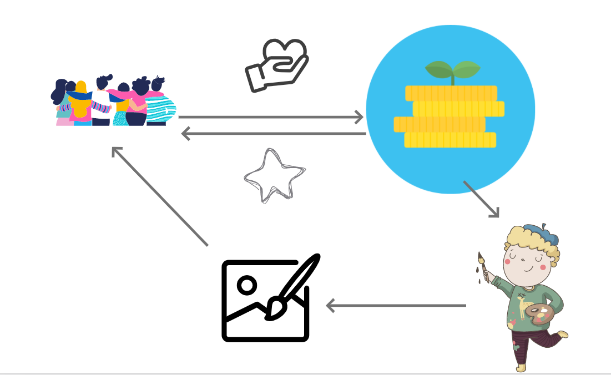

# 🔗 블록체인 비즈니스 모델 개발 - 미니  프로젝트 - Artademy (Art arcademy for young NFT artists based on donation)

### 프로젝트 개요

-   프로젝트 과정 : 2021 혁신성장 청년인재 양성사업, 블록체인을 활용한 비즈니스 모델 개발
-   프로젝트 명 : Artademy
-   프로젝트 기간 : 21.08.09 ~ 21.08.17

### 프로젝트 설명

Artademy(아타데미) 프로젝트란 기존 The Givers 프로젝트에 기부에 대한 목적을 강화하기 위해 만든 프로젝트입니다. 저는 기부에 대한 목적을 고민하다 '앞으로의 플랫폼 및 인터넷 사회에서 가장 중요한 것은 결국 컨텐츠이고 자기 개성을 담은 여러 크리에이터들이 많이 생겨졌으면 좋겠다'란 생각을 했습니다. 이로써 저는 기부에 대한 목적을 young artist나 creater를 육성하는데 필요한 펀딩을 만드는 플랫폼을 생각했고 Art 와 Arcademy를 합쳐 Artademy란 프로젝트를 기획하고 개발하였습니다. 물론 개발적인 측면에서 완성도가 그리 높지는 않지만 의미론적 측면에서 기부에 따른 토큰 이코노미와 이더리움 프로토콜 내 NFT들의 의미를 부여하는 거버넌스 측면에서 좋게 봐주시면 좋을 것 같습니다.
 

</img>

Artademy Project Flow

먼저 기부자들은 Artademy 플랫폼에 기부를 합니다. 그리고 기부를 한 만큼 ERC-20 토큰을 부여받습니다. 그리고 Artademy 플랫폼은 펀딩된 금액을 young artist들의 창작 활동를 하는데에 필요한 지원을 합니다. 또한, young artist들의 작품을 플랫폼 내에 NFT로 발행하여 배치합니다. 그리고 young artist의 작품성에 따라 기부자들은 그 NFT를 소유할 수도 그리고 특정 artist를 좀 더 육성시켜 더 좋은 NFT를 발행하게 하기 위한 추가 기부 및 특정 NFT를 opensea와 같은 마켓에 판매한 수익의 일부를 가져갈 수도 있습니다.

 

Artademy 프로젝트는 이런 거버넌스에 의하여 금전적 어려움 때문에 창작 활동에 어려움을 겪는 어린 친구들에게 꿈과 금전적 혜택을 제공하고 나아가 historical한 NFT Artist나 Creater로 활동하길 응원하는 플랫폼 프로젝트입니다.

---

#### Youtube link

#### 프로젝트 세부 내용 카피라이트

Main image source : https://pixabay.com/vectors/donation-money-box-aid-help-6164135/

#### 프로젝트 개발 스택

Front : Html + CSS + Bootstrap 

Blockchain Protocol : Ethereum Rinkeby Test Network 

Solidity framework : Remix 

Wallet : Metamask

